# 🗺️ Mapa de Arquitectura

Este diagrama de arquitectura interactivo fue generado de forma automática por **Phanes DNA** a partir del análisis estático de las dependencias e importaciones de tu código fuente.

```mermaid
graph TD
    subgraph domain [Domain]
        cmd_phanes_dna_main_go["main.go"]
        internal_ai_anthropic_go["anthropic.go"]
        internal_ai_config_go["config.go"]
        internal_ai_factory_go["factory.go"]
        internal_ai_gemini_go["gemini.go"]
        internal_ai_ollama_go["ollama.go"]
        internal_ai_provider_go["provider.go"]
        internal_analyzer_analyzer_go["analyzer.go"]
        internal_analyzer_generic_go["generic.go"]
        internal_analyzer_golang_go["golang.go"]
        internal_analyzer_java_go["java.go"]
        internal_analyzer_java_test_go["java_test.go"]
        internal_analyzer_oxlint_go["oxlint.go"]
        internal_analyzer_security_test_go["security_test.go"]
        internal_dna_compress_go["compress.go"]
        internal_dna_compress_bench_test_go["compress_bench_test.go"]
        internal_dna_compress_test_go["compress_test.go"]
        internal_dna_model_go["model.go"]
        internal_doctor_doctor_go["doctor.go"]
        internal_generator_generator_go["generator.go"]
        internal_generator_generator_test_go["generator_test.go"]
        internal_gitflow_commit_go["commit.go"]
        internal_gitflow_commit_test_go["commit_test.go"]
        internal_githooks_hooks_go["hooks.go"]
        internal_githooks_hooks_test_go["hooks_test.go"]
        internal_mcp_server_go["server.go"]
        internal_mcp_tools_go["tools.go"]
        internal_mcp_tools_test_go["tools_test.go"]
        internal_onboard_onboard_go["onboard.go"]
        internal_onboard_onboard_test_go["onboard_test.go"]
        internal_setup_installer_go["installer.go"]
        internal_setup_installer_test_go["installer_test.go"]
        internal_setup_rules_go["rules.go"]
        internal_tui_menu_go["menu.go"]
    end
    subgraph repository [Repository]
        internal_store_migrations_go["migrations.go"]
        internal_store_sqlite_go["sqlite.go"]
        internal_store_sqlite_test_go["sqlite_test.go"]
        internal_store_vector_go["vector.go"]
    end
    cmd_phanes_dna_main_go --> internal_ai_anthropic_go
    cmd_phanes_dna_main_go --> internal_ai_config_go
    cmd_phanes_dna_main_go --> internal_ai_factory_go
    cmd_phanes_dna_main_go --> internal_ai_gemini_go
    cmd_phanes_dna_main_go --> internal_ai_ollama_go
    cmd_phanes_dna_main_go --> internal_ai_provider_go
    cmd_phanes_dna_main_go --> internal_analyzer_analyzer_go
    cmd_phanes_dna_main_go --> internal_analyzer_generic_go
    cmd_phanes_dna_main_go --> internal_analyzer_golang_go
    cmd_phanes_dna_main_go --> internal_analyzer_java_go
    cmd_phanes_dna_main_go --> internal_analyzer_java_test_go
    cmd_phanes_dna_main_go --> internal_analyzer_oxlint_go
    cmd_phanes_dna_main_go --> internal_analyzer_security_test_go
    cmd_phanes_dna_main_go --> internal_dna_compress_go
    cmd_phanes_dna_main_go --> internal_dna_compress_bench_test_go
    cmd_phanes_dna_main_go --> internal_dna_compress_test_go
    cmd_phanes_dna_main_go --> internal_dna_model_go
    cmd_phanes_dna_main_go --> internal_doctor_doctor_go
    cmd_phanes_dna_main_go --> internal_gitflow_commit_go
    cmd_phanes_dna_main_go --> internal_gitflow_commit_test_go
    cmd_phanes_dna_main_go --> internal_githooks_hooks_go
    cmd_phanes_dna_main_go --> internal_githooks_hooks_test_go
    cmd_phanes_dna_main_go --> internal_mcp_server_go
    cmd_phanes_dna_main_go --> internal_mcp_tools_go
    cmd_phanes_dna_main_go --> internal_mcp_tools_test_go
    cmd_phanes_dna_main_go --> internal_onboard_onboard_go
    cmd_phanes_dna_main_go --> internal_onboard_onboard_test_go
    cmd_phanes_dna_main_go --> internal_generator_generator_go
    cmd_phanes_dna_main_go --> internal_generator_generator_test_go
    cmd_phanes_dna_main_go --> internal_setup_installer_go
    cmd_phanes_dna_main_go --> internal_setup_installer_test_go
    cmd_phanes_dna_main_go --> internal_setup_rules_go
    cmd_phanes_dna_main_go --> internal_store_migrations_go
    cmd_phanes_dna_main_go --> internal_store_sqlite_go
    cmd_phanes_dna_main_go --> internal_store_sqlite_test_go
    cmd_phanes_dna_main_go --> internal_store_vector_go
    cmd_phanes_dna_main_go --> internal_tui_menu_go
    internal_analyzer_analyzer_go --> internal_dna_compress_go
    internal_analyzer_analyzer_go --> internal_dna_compress_bench_test_go
    internal_analyzer_analyzer_go --> internal_dna_compress_test_go
    internal_analyzer_analyzer_go --> internal_dna_model_go
    internal_analyzer_generic_go --> internal_dna_compress_go
    internal_analyzer_generic_go --> internal_dna_compress_bench_test_go
    internal_analyzer_generic_go --> internal_dna_compress_test_go
    internal_analyzer_generic_go --> internal_dna_model_go
    internal_analyzer_golang_go --> internal_dna_compress_go
    internal_analyzer_golang_go --> internal_dna_compress_bench_test_go
    internal_analyzer_golang_go --> internal_dna_compress_test_go
    internal_analyzer_golang_go --> internal_dna_model_go
    internal_analyzer_java_go --> internal_dna_compress_go
    internal_analyzer_java_go --> internal_dna_compress_bench_test_go
    internal_analyzer_java_go --> internal_dna_compress_test_go
    internal_analyzer_java_go --> internal_dna_model_go
    internal_analyzer_oxlint_go --> internal_dna_compress_go
    internal_analyzer_oxlint_go --> internal_dna_compress_bench_test_go
    internal_analyzer_oxlint_go --> internal_dna_compress_test_go
    internal_analyzer_oxlint_go --> internal_dna_model_go
    internal_doctor_doctor_go --> internal_ai_anthropic_go
    internal_doctor_doctor_go --> internal_ai_config_go
    internal_doctor_doctor_go --> internal_ai_factory_go
    internal_doctor_doctor_go --> internal_ai_gemini_go
    internal_doctor_doctor_go --> internal_ai_ollama_go
    internal_doctor_doctor_go --> internal_ai_provider_go
    internal_doctor_doctor_go --> internal_store_migrations_go
    internal_doctor_doctor_go --> internal_store_sqlite_go
    internal_doctor_doctor_go --> internal_store_sqlite_test_go
    internal_doctor_doctor_go --> internal_store_vector_go
    internal_gitflow_commit_go --> internal_ai_anthropic_go
    internal_gitflow_commit_go --> internal_ai_config_go
    internal_gitflow_commit_go --> internal_ai_factory_go
    internal_gitflow_commit_go --> internal_ai_gemini_go
    internal_gitflow_commit_go --> internal_ai_ollama_go
    internal_gitflow_commit_go --> internal_ai_provider_go
    internal_mcp_server_go --> internal_ai_anthropic_go
    internal_mcp_server_go --> internal_ai_config_go
    internal_mcp_server_go --> internal_ai_factory_go
    internal_mcp_server_go --> internal_ai_gemini_go
    internal_mcp_server_go --> internal_ai_ollama_go
    internal_mcp_server_go --> internal_ai_provider_go
    internal_mcp_server_go --> internal_store_migrations_go
    internal_mcp_server_go --> internal_store_sqlite_go
    internal_mcp_server_go --> internal_store_sqlite_test_go
    internal_mcp_server_go --> internal_store_vector_go
    internal_mcp_tools_go --> internal_ai_anthropic_go
    internal_mcp_tools_go --> internal_ai_config_go
    internal_mcp_tools_go --> internal_ai_factory_go
    internal_mcp_tools_go --> internal_ai_gemini_go
    internal_mcp_tools_go --> internal_ai_ollama_go
    internal_mcp_tools_go --> internal_ai_provider_go
    internal_mcp_tools_go --> internal_dna_compress_go
    internal_mcp_tools_go --> internal_dna_compress_bench_test_go
    internal_mcp_tools_go --> internal_dna_compress_test_go
    internal_mcp_tools_go --> internal_dna_model_go
    internal_mcp_tools_go --> internal_onboard_onboard_go
    internal_mcp_tools_go --> internal_onboard_onboard_test_go
    internal_mcp_tools_go --> internal_store_migrations_go
    internal_mcp_tools_go --> internal_store_sqlite_go
    internal_mcp_tools_go --> internal_store_sqlite_test_go
    internal_mcp_tools_go --> internal_store_vector_go
    internal_mcp_tools_test_go --> internal_dna_compress_go
    internal_mcp_tools_test_go --> internal_dna_compress_bench_test_go
    internal_mcp_tools_test_go --> internal_dna_compress_test_go
    internal_mcp_tools_test_go --> internal_dna_model_go
    internal_mcp_tools_test_go --> internal_store_migrations_go
    internal_mcp_tools_test_go --> internal_store_sqlite_go
    internal_mcp_tools_test_go --> internal_store_sqlite_test_go
    internal_mcp_tools_test_go --> internal_store_vector_go
    internal_onboard_onboard_go --> internal_ai_anthropic_go
    internal_onboard_onboard_go --> internal_ai_config_go
    internal_onboard_onboard_go --> internal_ai_factory_go
    internal_onboard_onboard_go --> internal_ai_gemini_go
    internal_onboard_onboard_go --> internal_ai_ollama_go
    internal_onboard_onboard_go --> internal_ai_provider_go
    internal_onboard_onboard_go --> internal_dna_compress_go
    internal_onboard_onboard_go --> internal_dna_compress_bench_test_go
    internal_onboard_onboard_go --> internal_dna_compress_test_go
    internal_onboard_onboard_go --> internal_dna_model_go
    internal_onboard_onboard_go --> internal_store_migrations_go
    internal_onboard_onboard_go --> internal_store_sqlite_go
    internal_onboard_onboard_go --> internal_store_sqlite_test_go
    internal_onboard_onboard_go --> internal_store_vector_go
    internal_onboard_onboard_test_go --> internal_dna_compress_go
    internal_onboard_onboard_test_go --> internal_dna_compress_bench_test_go
    internal_onboard_onboard_test_go --> internal_dna_compress_test_go
    internal_onboard_onboard_test_go --> internal_dna_model_go
    internal_onboard_onboard_test_go --> internal_store_migrations_go
    internal_onboard_onboard_test_go --> internal_store_sqlite_go
    internal_onboard_onboard_test_go --> internal_store_sqlite_test_go
    internal_onboard_onboard_test_go --> internal_store_vector_go
    internal_setup_rules_go --> internal_dna_compress_go
    internal_setup_rules_go --> internal_dna_compress_bench_test_go
    internal_setup_rules_go --> internal_dna_compress_test_go
    internal_setup_rules_go --> internal_dna_model_go
    internal_store_sqlite_go --> internal_dna_compress_go
    internal_store_sqlite_go --> internal_dna_compress_bench_test_go
    internal_store_sqlite_go --> internal_dna_compress_test_go
    internal_store_sqlite_go --> internal_dna_model_go
    internal_store_sqlite_test_go --> internal_dna_compress_go
    internal_store_sqlite_test_go --> internal_dna_compress_bench_test_go
    internal_store_sqlite_test_go --> internal_dna_compress_test_go
    internal_store_sqlite_test_go --> internal_dna_model_go
    internal_store_vector_go --> internal_dna_compress_go
    internal_store_vector_go --> internal_dna_compress_bench_test_go
    internal_store_vector_go --> internal_dna_compress_test_go
    internal_store_vector_go --> internal_dna_model_go
    internal_tui_menu_go --> internal_ai_anthropic_go
    internal_tui_menu_go --> internal_ai_config_go
    internal_tui_menu_go --> internal_ai_factory_go
    internal_tui_menu_go --> internal_ai_gemini_go
    internal_tui_menu_go --> internal_ai_ollama_go
    internal_tui_menu_go --> internal_ai_provider_go
    internal_tui_menu_go --> internal_dna_compress_go
    internal_tui_menu_go --> internal_dna_compress_bench_test_go
    internal_tui_menu_go --> internal_dna_compress_test_go
    internal_tui_menu_go --> internal_dna_model_go
```

